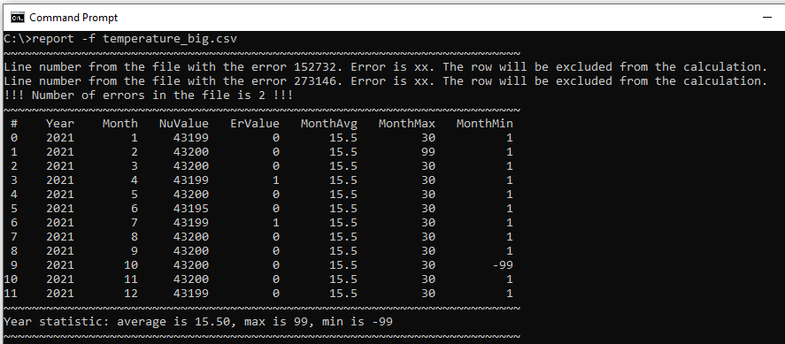
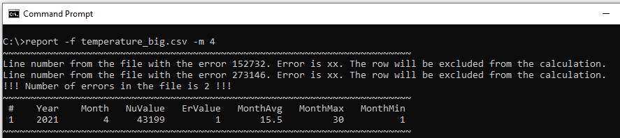

## Многомодульная программа
### Консольное приложение "Статистика температуры"

#### Приложение позволяет вывести следующие данные по температуре за месяц и год:

* среднемесячная температура;
* минимальная температура в текущем месяце;
* максимальная температура в текущем месяце;
* среднегодовая температура;
* минимальная температура за год;
* максимальная температура за год.

#### Приложение позволяет выявить ошибки в файле. Выводится следующая информация:

* номер строки файла с ошибкой;
* какие символы являются ошибочными;
* общее число ошибок в файле.

#### Приложение обрабатывает следующие аргументы командной строки:

* -h Описание функционала приложения;
* -m <номер месяца> Выводится статистика только за указанный месяц;
* -f <filename.csv> Указание входного файла *.csv для обработки.

#### Сборка приложения осуществляется при помощи утилиты make.

#### Файлы для тестирования работы приложения:

* temperature_small.csv
* temperature_big.csv

#### Примеры работы приложения:

* обработка показаний датчика температуры за год

* обработка показаний датчика температуры за указанный месяц

#### Состав репозитория:
<url> &#128194; final_work </url> - файлы проекта

<url> &#128194; images </url> - файлы *.png для README.md

<url> &#128194; report </url> - отчет по работе
